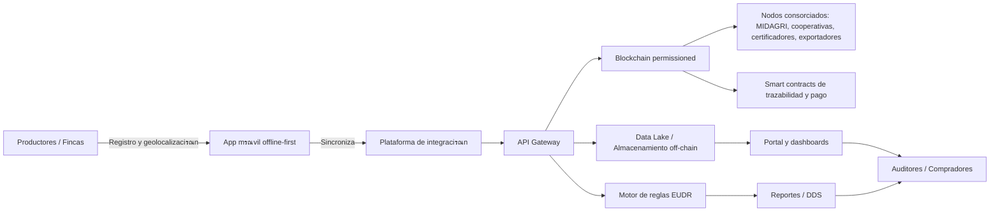

# Diagrama de Arquitectura de la Soluciรณn Blockchain

Este documento presenta la arquitectura propuesta para la soluciรณn hรญbrida blockchain orientada a cadenas agroexportadoras peruanas.

## Componentes clave

- **App mรณvil offline-first**: captura de datos en campo, georreferenciaciรณn, sincronizaciรณn diferida.
- **Plataforma de integraciรณn**: orquesta datos, valida formatos y conecta con MIDAGRI/AgroDigital.
- **API Gateway**: expone servicios a portales, aplicaciones y sistemas externos.
- **Almacenamiento off-chain**: documentos, imágenes, evidencia satelital, datos de IoT.
- **Blockchain permissioned**: registro inmutable de hashes, eventos de trazabilidad y smart contracts.
- **Motor de reglas EUDR**: valida cumplimiento de requisitos regulatorios y genera DDS.
- **Portal y dashboards**: visualización para cooperativas, exportadores, auditores y compradores.
- **Nodos consorciados**: aseguran gobernanza y validación compartida de la red.
