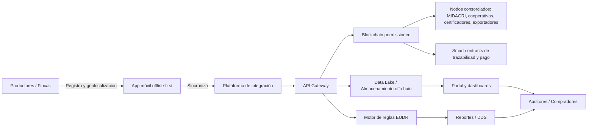

# Propuesta Integral de Solución Blockchain para Cadenas Agroexportadoras Peruanas

## Resumen ejecutivo
Esta propuesta plantea una solución de trazabilidad y cumplimiento orientada a cadenas agroexportadoras peruanas, con foco inicial en café y cacao, para responder a las exigencias del Reglamento (UE) 2023/1115 (EUDR) y a la creciente demanda de evidencia verificable por parte de compradores europeos.

La propuesta combina:
- una capa operativa de captura y gestión de datos;
- una capa de cumplimiento EUDR y debida diligencia;
- una capa de evidencia y auditoría con hashes y eventos trazables;
- una hoja de ruta realista que parte del **prototipo funcional actual** y evoluciona hacia una arquitectura híbrida permissioned.

El objetivo no es solo cumplir una exigencia regulatoria, sino construir una infraestructura de confianza que reduzca riesgos comerciales, fortalezca la posición de cooperativas y exportadores, e incremente la capacidad de los pequeños productores para participar en mercados premium.

## 1. Objetivo
Diseñar e implementar una solución híbrida blockchain que permita:
- garantizar trazabilidad verificable desde la finca hasta la exportación;
- soportar el cumplimiento del EUDR;
- mejorar la transparencia entre productores, cooperativas y exportadores;
- promover la inclusión económica de pequeños productores;
- generar evidencia confiable para mercados premium y financiamiento verde.

## 2. Estado actual del proyecto
El repositorio contiene hoy un **prototipo funcional** orientado a demostración, no una implementación completa de la arquitectura objetivo.

### Estado actual implementado
- backend `Express` con autenticación básica, CRUD de productores y lotes, compliance preliminar y blockchain local simulada;
- frontend `React + Vite` con dashboard, trazabilidad, alertas y flujo básico de compliance;
- persistencia local en archivos JSON para datos de demo;
- generación de un **DDS MVP** por lote con evidencia geoespacial base;
- integraciones externas todavía en modo mock o parcial.

### Lo que aún no existe en forma productiva
- validación oficial de deforestación post-2020 con fuentes satelitales consolidadas;
- integración formal al sistema de información de la UE para DDS;
- app móvil offline-first;
- smart contracts operativos de pagos o incentivos;
- ledger permissioned consorcial funcionando en producción.

Por tanto, este documento debe leerse como **propuesta objetivo + plan de transición** desde el prototipo actual.

## 3. Problema de negocio y cumplimiento
Las cadenas agroexportadoras peruanas enfrentan una combinación de restricciones estructurales:
- brechas de digitalización en pequeños productores;
- georreferenciación incompleta y datos de parcela imprecisos;
- asimetría de información entre cooperativas, acopiadores y exportadores;
- riesgos regulatorios por falta de evidencia robusta de cumplimiento EUDR;
- limitada capacidad de convertir atributos de sostenibilidad en mejor precio, acceso a mercado o financiamiento.

### Impacto concreto
- mayor riesgo de rechazo o retraso de embarques;
- mayor costo operativo para recopilar y validar evidencia;
- dependencia excesiva de intermediarios con control desigual de los datos;
- menor capacidad de respuesta ante auditorías o requerimientos de compradores europeos.

## 4. Requisitos regulatorios que la solución debe cubrir
La solución debe alinearse con tres exigencias centrales del EUDR:

1. **Libre de deforestación**
   - evidencia verificable de que el producto no proviene de tierras deforestadas o degradadas después del 31 de diciembre de 2020.

2. **Producción legal**
   - cumplimiento de legislación nacional aplicable en tenencia, ambiente, trabajo, derechos humanos y obligaciones tributarias.

3. **Declaración de Debida Diligencia (DDS)**
   - capacidad de consolidar evidencia, evaluar riesgo y emitir una declaración lista para revisión y futura integración con el sistema de la UE.

### Requisitos operativos mínimos
- identificación única de productor, predio, parcela y lote;
- coordenadas WGS84 y, cuando aplique, polígono completo;
- cadena de custodia desde origen hasta exportación;
- documentos y certificaciones vinculados al lote;
- evidencia de prácticas ambientales y sociales;
- trazabilidad auditable de cambios, validaciones y excepciones.

## 5. Alcance de la solución
### Productos foco
- Café
- Cacao
- Quinua
- Palta
- Banano
- Algodón Pima

### Cobertura funcional objetivo
- registro de productores y cooperativas;
- captura y validación de parcelas y lotes;
- trazabilidad de cadena de custodia;
- verificación de prácticas ambientales y sociales;
- generación de evidencias de cumplimiento EUDR;
- incentivos y automatización de pagos por resultados;
- reportes para auditores y compradores europeos;
- interoperabilidad con MIDAGRI / AgroDigital / PPA.

## 6. Actores y roles
- Productores familiares y pequeños productores
- Cooperativas y organizaciones agrarias
- Acopiadores y agregadores
- Exportadores y comercializadores
- MIDAGRI, SENASA y organizaciones públicas
- Certificadores orgánicos, fair trade y de sostenibilidad
- Compradores e importadores europeos
- Proveedores de tecnología satelital y monitoreo ambiental
- Proveedor tecnológico / operador de plataforma

## 7. Gaps críticos que aborda la solución
### 7.1. Madurez digital baja de pequeños productores
- onboarding simplificado;
- captura guiada con validaciones mínimas;
- futura operación móvil y offline-first;
- incentivos por datos completos y verificables.

### 7.2. Georreferenciación incompleta
- captura estructurada de coordenadas y polígonos;
- control de calidad geoespacial;
- hash inmutable de evidencia geográfica;
- futura validación con monitoreo satelital post-2020.

### 7.3. Brechas de datos entre actores
- modelo de datos compartido;
- historial auditable de eventos;
- gobernanza por roles;
- reducción del riesgo de mezcla, triangulación o pérdida de evidencia.

### 7.4. Cumplimiento EUDR insuficiente
- reglas de verificación de no deforestación y legalidad;
- registro de DDS;
- trazabilidad de evidencia usada en la evaluación;
- reportes listos para revisión por operadores, auditores y compradores.

## 8. Propuesta de valor
### Para productores y cooperativas
- menor barrera de entrada al cumplimiento;
- visibilidad de su trazabilidad y desempeño;
- mejor posición frente a compradores y certificadores.

### Para exportadores
- menor riesgo regulatorio;
- centralización de evidencia;
- menor tiempo de preparación de documentación.

### Para compradores europeos
- mayor confianza en el origen;
- evidencia trazable y auditable;
- mejor capacidad de evaluación de proveedores.

### Para el ecosistema público-privado
- mejor interoperabilidad;
- mejor calidad de datos sectoriales;
- base para programas de sostenibilidad e incentivos.

## 9. Arquitectura objetivo
### 9.1. Modelo híbrido
- **On-chain**: hashes de evidencia, eventos de trazabilidad, hitos críticos de compliance y, más adelante, smart contracts.
- **Off-chain**: datos de parcela, documentos, imágenes, reportes, resultados satelitales y datos operativos.

### 9.2. Implementación actual del prototipo
- **On-chain actual (demo)**: cadena local en servidor con bloques y hashes de eventos, clima y DDS.
- **Off-chain actual (demo)**: archivos JSON locales para productores, lotes, alertas, compliance y DDS.
- **Motor EUDR actual (demo)**: scoring preliminar y DDS MVP, sin validación oficial de deforestación.
- **Aplicación actual**: portal web React con autenticación básica.

### 9.3. Ledger permissioned recomendado
- opción principal: Hyperledger Fabric o Corda;
- alternativa: red EVM permissioned (Polygon, Quorum) si se prioriza interoperabilidad;
- gobernanza: nodos operados por cooperativas, exportadores, entidades públicas y certificadores.

### 9.4. Integraciones estratégicas
- MIDAGRI / AgroDigital / PPA para identidad, productores y predios;
- GeoPerú / Atlas Satelital para base cartográfica;
- Global Forest Watch / Satelligence / GeoBosques para monitoreo de deforestación;
- certificadoras de sostenibilidad;
- ERPs de exportadores y sistemas logísticos;
- plataformas de financiamiento verde.

### 9.5. Capas de la solución
1. **Capa de datos**: base relacional/NoSQL + almacenamiento de objetos.
2. **Capa de blockchain**: ledger permissioned, nodos consorciados y eventos auditables.
3. **Capa de integración**: APIs REST/GraphQL y conectores externos.
4. **Capa de aplicación**: portal web, futura app móvil y dashboards.
5. **Capa de gobernanza**: roles, permisos, auditoría, privacidad y calidad de datos.

### 9.6. Diagrama de arquitectura

## 10. Modelo de datos objetivo
- Productor
- Cooperativa
- Entidad certificadora
- Finca / Predio
- Parcela / Lote
- Polígono / Coordenadas
- Cosecha / Batch
- Evento de custodia
- Certificación
- Declaración de Debida Diligencia (DDS)
- Documento / Evidencia
- Transacción blockchain
- Hito de pago / incentivo

### Entidades que deben priorizarse desde ya
- Productor
- Predio
- Parcela
- Lote
- Evento de custodia
- Documento / evidencia
- DDS

## 11. Flujo de valor principal
1. Registro y validación de productor
2. Georreferenciación de parcelas
3. Creación y vínculo de lote con predio
4. Registro de prácticas y consumo de insumos
5. Generación de evidencia ambiental y social
6. Auditoría y certificación
7. Registro de cadena de custodia y transporte
8. Generación de DDS y reporte EUDR
9. Verificación de cumplimiento y liberación de hitos
10. Acceso a mercados premium y financiamiento

## 12. Módulos del sistema
### 12.1. Identidad y registro
- gestión de productores, cooperativas y permisos;
- integración con PPA/AgroDigital;
- firma de consentimientos y control de datos.

### 12.2. Georreferenciación y parcela
- captura de coordenadas y polígonos;
- validación de formato WGS84;
- control de calidad geoespacial;
- registro de evidencia satelital.

### 12.3. Trazabilidad y custodia
- eventos por cambio de titularidad;
- transporte, almacenamiento y procesamiento;
- codificación o QR por lote;
- auditoría de cambios.

### 12.4. Cumplimiento EUDR
- reglas de verificación de no deforestación;
- validación de legalidad;
- evaluación y priorización de riesgos;
- registro y reporte de DDS;
- alertas de riesgo y control de excepciones.

### 12.5. Incentivos y pagos
- hitos verificables de desempeño;
- futura automatización vía smart contracts;
- acceso a financiamiento verde y bonificaciones.

### 12.6. Reportes y auditoría
- reportes para compradores UE;
- auditorías internas y externas;
- visualización de métricas de sostenibilidad;
- trazabilidad de evidencia usada en cada decisión.

## 13. Brecha entre el prototipo y la solución objetivo
### Ya disponible en el prototipo
- portal web con autenticación básica;
- productores y lotes de ejemplo;
- panel de trazabilidad y alertas;
- compliance preliminar;
- DDS MVP con hash y evidencia geoespacial básica;
- blockchain local demostrativa.

### Pendiente para piloto real
- base de datos transaccional;
- modelo formal de predios y parcelas;
- motivos explícitos de `NEEDS_ACTION` en DDS;
- integración oficial con fuentes geoespaciales;
- gestión documental real;
- controles de legalidad y cadena de custodia más finos;
- seguridad, auditoría y operación multiusuario robusta.

## 14. Roadmap de implementación
### Fase 0: Diagnóstico y diseño
- validar actores y región piloto;
- analizar requisitos EUDR y normativas locales;
- definir gobernanza del consorcio;
- diseñar arquitectura y plan piloto.

### Fase 1: Consolidación del prototipo actual
- alinear documentación, frontend y backend;
- formalizar modelo de datos para productor, predio, parcela, lote y DDS;
- mejorar DDS MVP con explicaciones de `NEEDS_ACTION`;
- endurecer autenticación, roles y endpoints administrativos;
- reemplazar persistencia JSON por base de datos transaccional.

### Fase 2: MVP piloto
- producto inicial: cacao o café;
- actores: cooperativa, exportador y entidad pública;
- funcionalidades clave: registro, georreferenciación, trazabilidad y prueba EUDR básica;
- integración inicial con datos gubernamentales y validación documental.

### Fase 3: Escalamiento a múltiples cadenas
- añadir quinua, palta, banano y algodón pima;
- incluir certificaciones orgánicas y comercio justo;
- integrar pagos e incentivos;
- conectar con ERPs, logística y aduanas.

### Fase 4: Consolidación y gobernanza
- operar consorcio nacional;
- expandir nodos blockchain;
- ofrecer monitoreo continuo;
- incluir más actores de la cadena.

## 15. Beneficios esperados
- mayor confianza y transparencia;
- reducción de riesgos de rechazo en la UE;
- acceso a primas de precio por atributos trazables;
- inclusión de pequeños productores;
- mejor acceso a financiamiento verde;
- fortalecimiento de la gobernanza cooperativa.

## 16. Riesgos y mitigaciones
- **Conectividad rural**: app offline y sincronización diferida.
- **Resistencia cultural**: capacitación local y soporte con liderazgos comunitarios.
- **Costo inicial**: esquema público-privado y subsidios de piloto.
- **Privacidad**: cumplimiento Ley 29733, control de acceso y DPIA.
- **Gobernanza**: reglas de consorcio, trazabilidad de cambios y separación por roles.
- **Calidad geoespacial**: validaciones de formato, precisión y consistencia.
- **Falsa sensación de cumplimiento**: diferenciar claramente entre DDS MVP y validación oficial EUDR.

## 17. Recomendación concreta
- implementar un enfoque **small producer first**;
- priorizar un piloto en **cacao o café**;
- respaldar interoperabilidad con **MIDAGRI/AgroDigital**;
- construir primero una base sólida de datos, DDS y trazabilidad;
- evolucionar después hacia ledger permissioned y automatización avanzada.

## 18. Plan piloto detallado
### 18.1. Objetivo
Validar un piloto de solución blockchain para una cadena agroexportadora peruana que demuestre trazabilidad EUDR-compatible, inclusión de pequeños productores y gobernanza compartida.

### 18.2. Alcance del piloto
- producto inicial: cacao o café;
- región piloto: San Martín, Piura o Cajamarca;
- actores: cooperativa, exportador, MIDAGRI u otra entidad pública, certificador y productor final;
- funcionalidades: registro de productor, georreferenciación de parcela, trazabilidad de lote, prueba de no deforestación, reporte DDS y flujo de pago básico.

### 18.3. Entregables
- informe de diagnóstico de actores y brechas;
- MVP web funcional para portal piloto;
- diseño de app móvil offline-first para siguiente iteración;
- plataforma de integración con APIs a PPA/AgroDigital;
- ledger local de prototipo y diseño de nodo permissioned de siguiente fase;
- reporte EUDR y DDS MVP para al menos un lote piloto;
- evaluación de métricas de adopción, calidad de datos y cumplimiento.

### 18.4. Cronograma estimado
1. Mes 1-2: diagnóstico, definición de alcance y diseño técnico.
2. Mes 3-4: fortalecimiento del MVP, base de datos e integración inicial.
3. Mes 5-6: trazabilidad avanzada, documental y validación geoespacial.
4. Mes 7-8: ejecución piloto en terreno y generación de reportes.
5. Mes 9: cierre, lecciones aprendidas y plan de escalamiento.

### 18.5. Métricas de éxito
- porcentaje de productores registrados y georreferenciados;
- porcentaje de lotes con evidencia trazable y DDS emitida;
- tiempo de generación de reporte EUDR frente al proceso actual;
- grado de interoperabilidad con PPA/AgroDigital;
- satisfacción de cooperativas y exportadores;
- porcentaje de DDS que pasan de `NEEDS_ACTION` a estado revisable.

### 18.6. Modelo de gobernanza
- consorcio piloto: cooperativa, exportador, MIDAGRI, certificador y proveedor tecnológico;
- validadores: nodos operados por actores clave en siguiente fase;
- reglas básicas: validación de datos, autorización de escritura, control de acceso a información sensible;
- mecanismo de resolución: comité técnico para discrepancias y excepciones.

### 18.7. Consideraciones técnicas
- en el prototipo actual se usa portal web; la app móvil queda como siguiente fase;
- el almacenamiento off-chain debe contener documentos y evidencia satelital con hashes trazables;
- las reglas EUDR actuales son preliminares y deben evolucionar a validaciones auditables;
- la conexión a monitoreo satelital y validación oficial de cobertura forestal sigue pendiente;
- la arquitectura permissioned debe implementarse cuando el modelo de datos y la gobernanza estén suficientemente estabilizados.

## 19. Próximo paso recomendado
Desarrollar un plan técnico-operativo de piloto que incluya:
- backlog priorizado por fases;
- arquitectura detallada por componentes;
- diseño de modelo de datos;
- estrategia de integración institucional;
- métricas de éxito;
- estimación de inversión, operación y financiamiento.

---

*Documento de propuesta integral para evolucionar el prototipo actual hacia una solución híbrida de trazabilidad y cumplimiento EUDR aplicada a cadenas agroexportadoras peruanas.*
